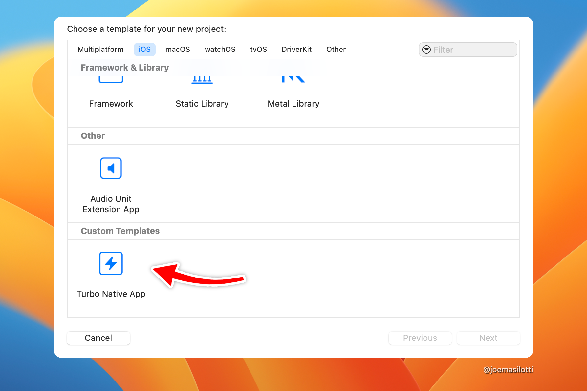

# Hotwire Native app template for Xcode

A custom Xcode project template to get started with Hotwire Native development.



Once installed, this template can be used directly in Xcode to generate a new Hotwire Native project. It removes boilerplate around creating new Xcode projects and integrating with Hotwire Native.

> **Note**: This project is an experiment with frequent, breaking changes as I learn how Xcode templates work.

## Getting started

First, make sure you have Xcode downloaded and installed from the [App Store](https://apps.apple.com/us/app/xcode/id497799835).

### Install the template

Create a new directory for custom Xcode project templates. Then clone this repo into that directory.

```bash
export DIR=~/Library/Developer/Xcode/Templates/Custom\ Templates
mkdir -p $DIR
git clone https://github.com/joemasilotti/TurboNativeXcodeTemplate.git $DIR/Turbo\ Native\ App.xctemplate
```

### Create a new project

Open Xcode and create a new project via File → New → Project…

Select iOS from the tabs across the top and scroll to the bottom.

Select _Hotwire Native App_, click Next, enter the name of your app, and click Next again.

You might also need to add an organization identifier if you aren't signed in to an App Store Connect team in Xcode.

### Add the Hotwire Native package dependency

Unfortunately, Xcode project templates don't directly support Swift packages. So we have to add it manually.


1. Click File → Add Packages…
2. In the search box in the upper right, enter: `[[https://github.com/hotwired/turbo-ios](https://github.com/hotwired/hotwire-native-ios)]`
3. Click Add Package
4. Click Add Package, again

Run the app via Product → Run. If all went well it should launch in the simulator!

For the best experience, start a Rails server with Turbo.js enabled on port 3000.
